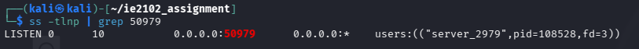
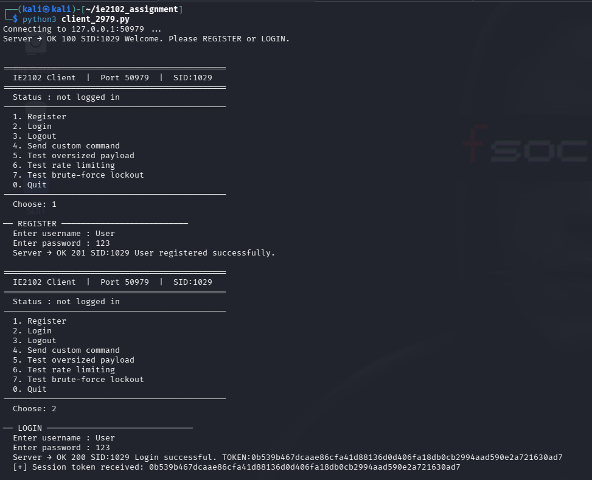
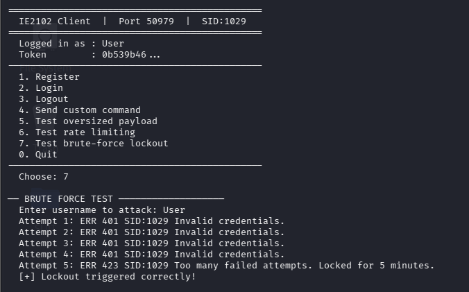
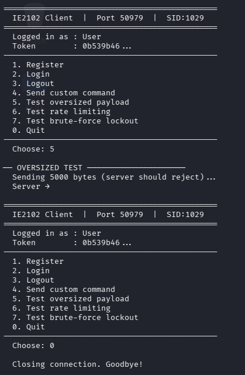
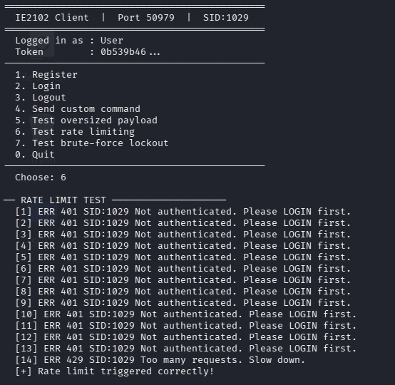
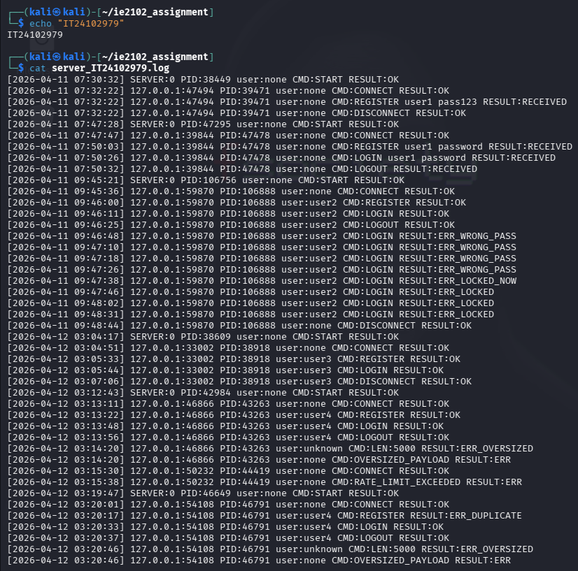
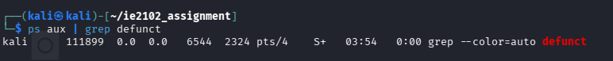

# IE2102 — Secure Multiprocessor TCP Server

A secure, multi-client TCP application server built from scratch in **C** and **Python** as part of the IE2102 Network Programming module at **SLIIT** (Sri Lanka Institute of Information Technology).

---

## What This Project Does

This project implements a fully functional client-server system over a TCP network. The server handles multiple clients simultaneously, authenticates users securely, and protects against common network attacks.

Think of it as a mini secure messaging server — built entirely using low-level socket programming without any external frameworks.

---

## Features

| Feature | Description |
|---|---|
| **Custom TCP Protocol** | LEN framing — every message prefixed with `LEN:<n>` so the server knows exact byte count |
| **Multiprocessing** | Uses `fork()` to handle 10+ clients concurrently — each client gets its own child process |
| **User Authentication** | REGISTER / LOGIN / LOGOUT with salted SHA-256 password hashing |
| **Session Tokens** | Random 64-char hex token issued on login, expires after 5 min of inactivity |
| **Rate Limiting** | Max 20 messages per minute per client — excess requests rejected with HTTP 429 |
| **Brute Force Protection** | Account locked for 5 minutes after 5 consecutive wrong passwords |
| **Admin KICK Command** | Admin-only command to kick active users |
| **Token Expiry** | Expired tokens rejected with error 440 and session cleared |
| **Audit Logging** | Every action logged with timestamp, IP, PID, username, command and result |
| **Zombie Prevention** | SIGCHLD handler with `waitpid()` cleans up child processes automatically |

---

## Tech Stack

| Layer | Technology |
|---|---|
| Server | C (gcc) |
| Client | Python 3 |
| Hashing | OpenSSL SHA-256 |
| Protocol | TCP (raw sockets) |
| Build | GNU Make |
| OS | Linux (Kali) |

---

## Project Structure

```
ie2102_assignment/
│
├── server_2979.c          # C server — handles all clients
├── client_2979.py         # Python client — interactive menu
├── Makefile_2979          # Build file for gcc
├── server_IT24102979.log  # Audit log (auto-generated)
└── README.md
```

---

## How the Protocol Works

Every message from client to server uses **LEN framing**:

```
LEN:22
REGISTER user1 pass123
```

The number after `LEN:` tells the server exactly how many bytes to read next. This solves the partial receive problem in TCP streams.

Server always responds in this format:

```
OK  200 SID:1029 Login successful. TOKEN:a3f7bc...
ERR 401 SID:1029 Invalid credentials.
ERR 429 SID:1029 Too many requests. Slow down.
```

---

## Getting Started

### Prerequisites

```bash
sudo apt update
sudo apt install gcc make python3 libssl-dev net-tools -y
```

### Setup

```bash
# Clone the repo
git clone https://github.com/yourusername/ie2102-tcp-server.git
cd ie2102-tcp-server

# Create required data directory
sudo mkdir -p /srv/ie2102/IT24102979/kali
sudo chown -R $USER:$USER /srv/ie2102/IT24102979

# Build the server
make -f Makefile_2979

# Run the server
./server_2979
```

### Run the Client

Open a second terminal:

```bash
python3 client_2979.py
```

---

## Available Commands

| Command | Description | Auth Required |
|---|---|---|
| `REGISTER <user> <pass>` | Create a new account | No |
| `LOGIN <user> <pass>` | Login and receive session token | No |
| `LOGOUT` | End session and clear token | Yes |
| `KICK <user>` | Force disconnect a user | Yes (admin only) |

---

## Security Features In Detail

### Salted Password Hashing
Passwords are never stored in plain text. A random 16-byte salt is generated per user using `RAND_bytes()`. The salt is combined with the password and hashed using SHA-256 before storing.

```
stored = SHA256(salt + password)
```

### Session Tokens
On successful login, a random 32-byte token is generated and sent to the client. Every protected command must include `TOKEN:<value>`. Tokens expire after **5 minutes** of inactivity.

### Rate Limiting
Each client connection tracks a message counter. If more than **20 messages** are received within 60 seconds, the server responds with `ERR 429` and disconnects the client.

### Brute Force Lockout
After **5 consecutive failed login attempts**, the account is locked for **5 minutes**. The remaining lockout time is shown in the error response.

---

## Screenshots

### Server Running


### Successful Register and Login


### Brute Force Lockout


### Over Size Payload


### Rate Limiting 


### Audit Log File


### No Zombie Processes


---

## What I Learned

- How TCP sockets work at a low level in C
- How `fork()` enables concurrent client handling without threads
- Why password salting matters and how SHA-256 hashing works
- How to design a custom binary/text protocol with framing
- How to implement real security features like rate limiting and token expiry
- How SIGCHLD and `waitpid()` prevent zombie processes

---

## Module Details

| | |
|---|---|
| **Module** | IE2102 — Network Programming |
| **Year** | 2nd Year, Semester 2 |
| **University** | Sri Lanka Institute of Information Technology (SLIIT) |
| **Grade Contribution** | 25% of final grade |

---

## Author

Thisul De Silva
IT24102979 | BSc (Hons) Information Technology — Cybersecurity
SLIIT, Sri Lanka

[](https://linkedin.com/in/thisul-de-silva/)
[](https://github.com/IT24102979)
